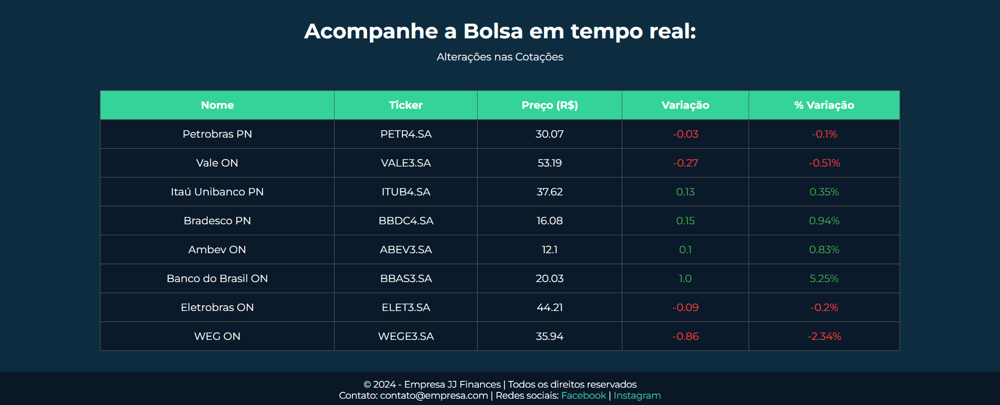
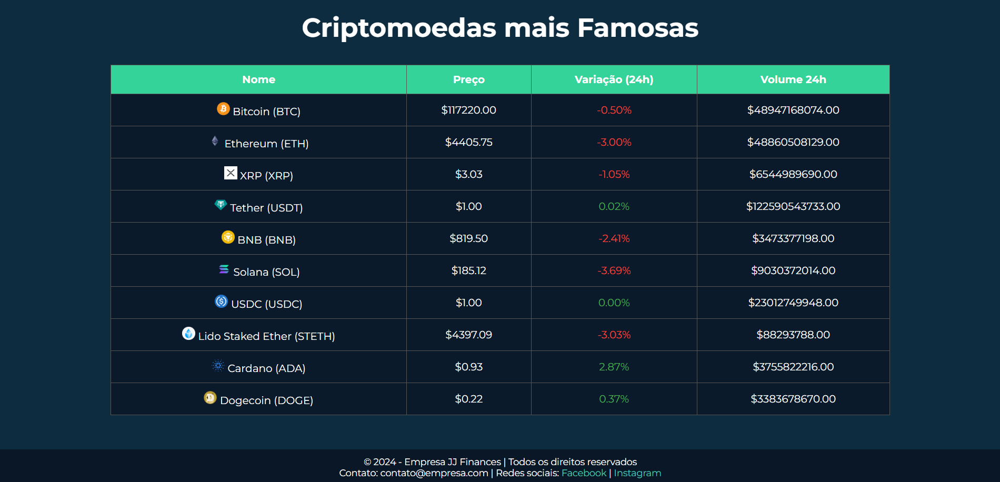

# jj-finances
---
O site JJ Finances 8=====D é uma aplicação web desenvolvida com o fim de informar e guiar o usuário em processos de investimentos realizados dentro e fora da bolsa de valores.

# Demonstração Visual 🔎

# Tecnologias Utilizadas 💻
- **HTML:** Estruturação do site
- **CSS:** Estilização e interações com o usuário
- **Python:** Linguagem de programação utilizada para construção da aplicação web
- **Flask:** Microframework utilizado para inicialização do servidor, navegação por rotas e integração de API de Recaptcha
- **Javascript:** Linguagem de programação utilizada para manipulação de dados e integração da API da bolsa de valores
- **Yfinance:** Biblioteca da bolsa de valores para atualização de dados em tempo real

# Pré-Requisitos ⚙
